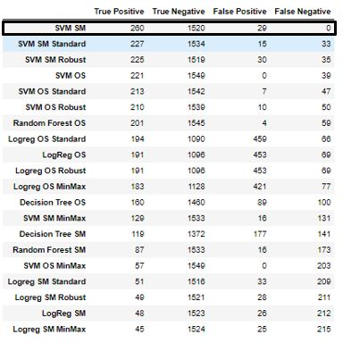

# Predicting Automobile Insurance Renewal

## Business Background
Automobile Insurance memberikan perlindungan finansial terhadap kerusakan fisik terhadap kendaraan maupun cedera tubuh (berkenaan dengan biaya medis) akibat tabrakan lalu lintas dan insiden lainnya yang tidak melibatkan tabrakan seperti pencurian, kebakaran, banjir maupun benda jatuh yang mengenai mobil.

## Problem
Perusahaan ingin memberikan penawaran renewal asuransi kepada customernya. Namun menghubungi semua customer tentu menghabiskan cost yang lebih banyak sehingga diperlukan prediksi customer mana yang kira kira akan dihubungi dan setuju untuk melakukan pembaruan asuransi. Disamping itu, mempertahankan customer agar tetap berlangganan asuransi dalam jangka waktu yang lama lebih efektif dibandingkan dengan mencari customer baru.

## Goals
- Mengurangi cost komunikasi
- Mempertahankan customer yang mengambil layanan asuransi mobil agar tetap menjadi nasabah
- Membangun model untuk memprediksi terkait ketertarikan customer untuk renewal asuransi kendaraan sehingga dapat membantu perusahaan dalam melakukan perencanaan terhadap strategi komunikasi.

## Conclusion
- Hanya ~14% customer yang setuju untuk renewal automobile insurance
- Lebih banyak customer merespon yes pada basic coverage
    - karena sudah cukup untuk menanggung hal dasar ketika terjadi kecelakaan. Pembayaran premi lebih murah sehingga sesuai dengan kebutuhan mendasar dan budget customer.
- Lebih dari 50% respon yes berasal dari customer yang memiliki pekerjaan
    - karena memiliki penghasilan yang dapat digunakan untuk membayar premi. Dan juga ada beberapa pekerjaan yang membutuhkan asuransi mobil misalnya supir yang memiliki resiko lebih tinggi selama mengemudi.
- Lebih banyak customer dari suburban yang merespon yes
- Personal auto policy menjadi tipe polis yang paling banyak renewal
    - berarti policy jenis ini sesuai dengan kebutuhan sebagian besar customer di perusahaan. Sebagain besar customer memiliki mobil pribadi dan bukan mobil yang digunakan untuk bisnis atau customer tidak terdaftar di federal medicaid with hospitalization. Personal policy ini biasanya menjamin pemilik kendaraan dan satu atau dua anggota keluarga dekat.
- Offer 1 dan offer 2 lebih menarik/valuable bagi customer
- Customer yang memiliki pekerjaan dan marital status apapun terutama married lebih banyak tertarik untuk renewal
- Orang yang pendidikan terakhir high school or below memiliki resiko dalam berkendara lebih tinggi sehingga akan lebih banyak melakukan claim. Menurut basis demografis, orang yang berpendidikan tinggi cenderung menjadi pengemudi yang bertanggung jawab. https://www.carinsurance101.com/does-my-education-level-affect-my-car-insurance/
- Customer Oregon dan Arizona yang merespon yes memiliki clv hampir di rata – rata sehingga kedua state ini potensial bagi revenue perusahaan.
- Customer low income lebih banyak tertarik untuk renewal ketika ditawari offer 1
- Customer high income lebih banyak tertarik untuk renewal ketika ditawari offer 2
- Customer cenderung tidak tertarik untuk offer 3 dan 4 sehingga offer ini tidak valuable menurut customer
- Setiap Renew Offer Type memiliki karakteristik customer yang cenderung berbeda

## Recommendation
- **Jika ingin menghubungi customer, prioritaskan dengan karakteristik berikut :**
    - Orang yang sudah menikah dan atau sudah bekerja memiliki peluang lebih tinggi untuk memenuhi tagihan. Selain itu juga memiliki keamanan finansial yang lebih besar daripada single customer atau unemployed customer karena mereka dapat mengumpulkan aset. Ketika sudah menikah terutama tentunya masalah keuangan menjadi hal yang perlu diperhatikan. Maka married customer cenderung ingin mengurangi beban biaya dan menjaga aset mereka salah satunya kendaraan ketika terjadi kasus kecelakaan, kehilangan atau pencurian, kerusakan akibat banjir dan lainnya sehingga tidak mengganggu untuk kebutuhan lainnya. https://cover.com/blog/car-insurance-married-vs-single/#:~:text=To%20insurers%2C%20the%20existence%20of,able%20to%20pool%20their%20assets.
    - Customer dengan basic coverage karena di united state, pada beberapa statenya mewajibkan untuk memiliki asuransi kendaraan minimal penanggungan cedera tubuh dan kerusakan properti sehingga sudah cukup untuk menanggung hal dasar ketika terjadi kecelakaan. Pembayaran premi lebih murah sehingga sesuai dengan kebutuhan mendasar dan budget customer.
    - Personal Auto Policy yang mana policy jenis ini sesuai dengan kebutuhan sebagian besar customer di perusahaan. Sebagain besar customer memiliki mobil pribadi dan bukan mobil yang digunakan untuk bisnis atau customer tidak terdaftar di federal medicaid with hospitalization. Personal policy ini biasanya menjamin pemilik kendaraan dan satu atau dua anggota keluarga dekat.
    - Customer dengan level pendidikan tinggi karena lebih cenderung menjadi pengemudi yang bertanggung jawab sehingga akan memiliki claim rate yang rendah
    - Customer di suburban karena memiliki rata - rata clv diatas nilai rata – rata yang berarti potensial bagi revenue perusahaan karena dapat berperan besar dalam aktivitas bisnis perusahaan.
- **Berikan tipe penawaran yang tepat sasaran kepada customer**
  a. Berdasarkan Vehicle Class dan Size
    - Offer 1 : Four-Door Car (Large), Luxury Car (Small), Luxury SUV (Med), SUV (Large, Med, Small), Sport Car (Large)
    - Offer 2 : Four-Door Car (Large, Med, Small), Luxury Car (Med), Luxury SUV (Small), SUV (Large, Small), Sport Car (Med), Two-Door Car (Large, Med, Small)
  b. Berdasarkan Employment Status
    - Offer 1 : Disabled, Medical Leave, Retired, Unemployed
    - Offer 2 : Employed
  c. Berdasarkan Income Group
    - Offer 1 : Low Income
    - Offer 2 : Medium dan High Income
  d. Berdasarkan Coverage
    - Offer 1 : Premium
    - Offer 2 : Basic, Extended
  e. Berdasarkan Premi
    - Offer 1 : Premi 85 - 150 dollar (Premi sedang) dan more than 150 dollar (Premi tinggi)
    - Offer 2 : Premi 0 - 85 (Premi rendah)    
- **Offer 3 dan 4 dapat dihapuskan dari kebijakan untuk penawaran renewal karena tidak valuable melihat dari respon customer**
- **Customer yang tidak tertarik renewal, tanyakan alasannya**
  1. Jika karena terkendala biaya, maka bisa ditawarkan untuk menurunkan tipe coverage (dari premium ke basic) atau level policy (personal level 2 ke personal level 1)
  2. Jika karena mobil sudah tidak bersama yang bersangkutan (dijual) dapat menghubungi kembali secara berkala ketika customer sudah membeli mobil baru (dikhususkan untuk customer high income karena akan lebih memungkinkan untuk membeli mobil karena keamanan finansial)
- **Customer yang tidak tertarik untuk renewal**
  1. Jika perusahaan terintegrasi dengan bank : dapat dihubungi kembali setelah ada update biodata misalnya customer yang unemployed sudah mendapatkan pekerjaan sehingga lebih potensial untuk menerima asuransi karena sudah memiliki penghasilan dan tawarkan berdasarkan offer yang sesuai
  2. Jika perusahaan stand alone : dapat dihubungi secara berkala, customer yang kira kira potensial untuk melakukan pembayaran premi secara lancar misalnya Employed ataupun medium - high income customer
  
## Machine Learning

FN merupakan jumlah customer yang diprediksi tidak tertarik untuk renewal padahal aktualnya tertarik yang berakibat pada perusahaan kehilangan kesempatan untuk mempertahankan customer. FP merupakan jumlah customer yang diprediksi tertarik padahal aktualnya tidak tertarik yang berakibat pada perusahaan akan mengeluarkan biaya komunikasi lebih banyak. Untuk memenuhi kedua kondisi tersebut, diperlukan nilai FN dan FP yang paling optimal dari semua model sehingga model yang dipilih adalah Random Forest dengan Random Over Sampling.
